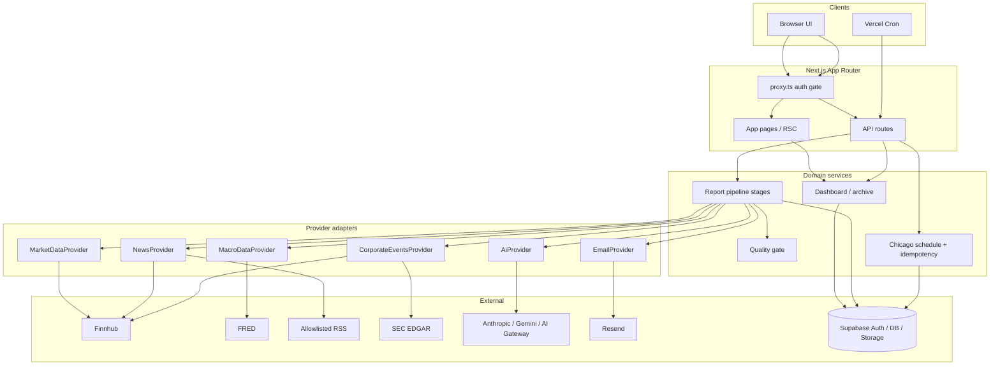

# Architecture

## Boundaries

| Layer | Responsibility | Must not |
| --- | --- | --- |
| **UI** (`src/app`, `src/components`) | Pages, forms, client query | Call vendor APIs directly; hold secrets |
| **API / actions** (`src/app/api`) | Authz → Zod → domain services | Embed provider HTTP details |
| **Domain** (`src/lib/domain`, `src/lib/reports`) | Movers, clustering, citations, pipeline, quality gate | Depend on a specific vendor SDK |
| **Providers** (`src/lib/providers`) | Normalize external data behind interfaces | Leak raw vendor shapes into reports |
| **AI** (`src/lib/ai`) | Structured generation + orchestration | Invent numbers outside evidence |
| **Supabase** | Auth, Postgres+RLS, Storage | Store API keys in `provider_configs` |
| **Cron** (`/api/cron/*`) | Tick enqueue + worker advance | Run without `CRON_SECRET` in production |

Single-tenant v1: one firm (`default` / seeded Research Desk). Roles: `admin` | `member` ([`permissions.ts`](../src/lib/domain/permissions.ts)).

## Data flow

## Provider adapters

Interfaces live in [`src/lib/providers/interfaces.ts`](../src/lib/providers/interfaces.ts). Normalization schemas are in [`types.ts`](../src/lib/providers/types.ts).

[`createProviders`](../src/lib/providers/registry.ts) resolves each slot:

1. Live credential present **and** real factory registered → live adapter  
2. Else `ALLOW_MOCK_PROVIDERS` and non-production → mock  
3. Else throw (production fail-closed)

| Slot | Live adapter | Credential |
| --- | --- | --- |
| Market | Finnhub quotes/movers | `FINNHUB_API_KEY` |
| News | Finnhub + RSS composite | `FINNHUB_API_KEY` and/or `NEWS_RSS_FEEDS` |
| Macro | FRED observations | `FRED_API_KEY` |
| Corporate | EDGAR filings (+ Finnhub / Alpha Vantage earnings when keyed) | EDGAR always in non-mock; optional calendar keys |
| AI | Orchestrated Anthropic / Gemini / AI Gateway | any AI key |
| Email | Resend | `RESEND_API_KEY` |
| Scheduler | In-process Chicago due-edition enqueue | live outside mocks |

`SourceRegistry` tracks enablement, health, rate limits, and required env vars for admin/ops surfaces.
