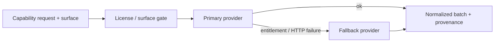

# Market-data architecture

Affordable real-time market-data layer for Research Desk. Plan: [`market-data-followup-plan.md`](./market-data-followup-plan.md). Owner activation: [`owner-market-data-checklist.md`](./owner-market-data-checklist.md).

**Status:** adapters, schemas, licensing, and router are implemented. Shared production real-time is **not** activated until the owner completes entitlements, secrets, and checklist approval. This app does not purchase vendor plans for you.

## Capability routing

Capabilities are separate contracts in [`capabilities.ts`](../src/lib/market-data/capabilities.ts):

| Capability | Interface | Typical use |
| --- | --- | --- |
| `quotes` | `QuoteProvider` | Last/bid/ask tape |
| `bars` | `BarProvider` | OHLC series |
| `snapshots` | `MarketSnapshotProvider` | Batch refresh input |
| `movers` | `MoverProvider` | Ranked movers within a **configured universe** |
| `reference` / `corporateActions` | `ReferenceDataProvider` | Instruments, dividends, splits (Massive) |
| `marketClock` | `MarketClockProvider` | Session / open-closed |

[`MarketDataRouter`](../src/lib/market-data/router.ts) picks primary/fallback from env (`MARKET_DATA_PRIMARY` / `MARKET_DATA_FALLBACK`: `alpaca` | `massive` | `finnhub` | `none`). Each request carries a `ProductSurface`; the router rejects disallowed surfaces via [`licensing.ts`](../src/lib/market-data/licensing.ts).

Registry resolution ([`registry.ts`](../src/lib/providers/registry.ts)): routed provider → Finnhub key → mock (non-production only). Finnhub may remain a delayed fallback.



## Provenance rules (IEX ≠ SIP)

Every observation carries `feedCoverage` and `latencyClass` ([`schemas.ts`](../src/lib/market-data/schemas.ts)).

| Rule | Behavior |
| --- | --- |
| IEX is not SIP | `ALPACA_STOCK_FEED=iex` → `feedCoverage: "iex"` only |
| No false NBBO / full market | Labels never claim SIP, NBBO, or full-market consolidated volume for IEX |
| Fallback keeps its own labels | Router must not rewrite fallback feed/latency to the primary’s |
| UI / reports | Use `latencyCoverageLabel()` — e.g. “Real-time — IEX” |

Alpaca coverage notes explicitly state single-exchange IEX when applicable. Breadth is only meaningful when coverage is `sip` or `full_market`; otherwise return null with an explanation.

## Refresh flow

Cron tick (`/api/cron/tick`, every 5 minutes) also drives market refresh when due, in addition to report enqueue. Adaptive interval uses session + env:

| Session band | Env | Default |
| --- | --- | --- |
| Regular open | `MARKET_DATA_REFRESH_OPEN_SECONDS` | 60 |
| Extended (pre/AH) | `MARKET_DATA_REFRESH_EXTENDED_SECONDS` | 120 |
| Closed / overnight | `MARKET_DATA_REFRESH_CLOSED_SECONDS` | 300 |

```mermaid
sequenceDiagram
  participant Cron as Vercel cron tick
  participant Lock as Advisory lock / lease
  participant Uni as Universe builder
  participant Rtr as MarketDataRouter
  participant Cache as Observation cache
  participant DB as market_refresh_runs / usage

  Cron->>Lock: tryAcquire
  alt lock held by peer
    Lock-->>Cron: skip (no double-fetch)
  else acquired
    Lock->>Uni: build symbols (cap MAX_UNIVERSE_SIZE)
    Uni->>Rtr: snapshots / quotes (surface=dashboard_display)
    Rtr-->>Cache: normalize + validate; write latest
    Note over Cache: On failure keep last valid; mark stale
    Cache->>DB: refresh run + usage + health events
    Lock-->>Cron: release
  end
```

**Locks:** in-process mutex plus optional DB claim so overlapping ticks do not storm the vendor API.

**Universe:** major index ETFs, sector ETFs, seeded AI-infra names, watchlist, and in-progress report symbols — capped by `MARKET_DATA_MAX_UNIVERSE_SIZE` (default 80). Movers are ranked inside that universe only (not exchange-wide).

## Caching

- Latest quotes/snapshots keyed by ticker with full provenance.
- Optional short ring of minute bars.
- Stale threshold: `MARKET_DATA_STALE_AFTER_SECONDS` (default 180).
- Dashboard reads **cache only** (no per-page provider fan-out).
- Never zero-fill missing prices; failed refresh preserves last good observation and marks `latencyClass: "stale"` when aged out.

## Schema (Postgres)

Migration: [`20260811000000_market_data_realtime.sql`](../supabase/migrations/20260811000000_market_data_realtime.sql).

| Table / change | Purpose |
| --- | --- |
| `provider_license_configs` | Non-secret scope, acknowledgement flag, permitted surfaces, feed |
| `market_observations_latest` | One latest row per firm/instrument/provider/feed |
| `market_bars` (+ feed/latency/bar_start) | Bars with provenance uniqueness |
| `market_refresh_runs` + `market_refresh_universe_symbols` | Auditable refresh runs |
| `provider_usage_counters` | Minute/hour/day request & symbol counts |
| `provider_health_events` (+ firm/event_kind) | Entitlement / fallback / down |
| `report_market_snapshots` | Immutable freeze for reports |

Secrets stay in env — never in `provider_configs` or license rows. RLS: members read firm data; admins mutate config/ops writes (service role for cron).

## Licensing & surfaces

Scopes: `single_user_development` | `internal_team` | `redistributable`.

| Scope | Default surfaces (abbrev.) |
| --- | --- |
| `single_user_development` | dashboard, server calc, derived charts |
| `internal_team` | + archived, in-app reports, PDF, AI input |
| `redistributable` | + email attachment |

Production shared use fails closed unless scope is `internal_team` or `redistributable` **and** `MARKET_DATA_LICENSE_ACKNOWLEDGED=true`. Acknowledgement is an **operational guardrail**, not proof of a vendor license — see owner checklist.

## Session baselines

[`session-math.ts`](../src/lib/market-data/session-math.ts): premarket/regular change vs **prior regular close**; after-hours also vs today’s official close. Null inputs stay null (no coerce-to-zero).

## Related docs

- [`data-sources.md`](./data-sources.md) — Alpaca, Massive, Finnhub, …
- [`report-methodology.md`](./report-methodology.md) — freeze, movers wording, quality gate
- [`operations-runbook.md`](./operations-runbook.md) — entitlement / stale / switchover
- [`deployment.md`](./deployment.md) — secrets and cron
